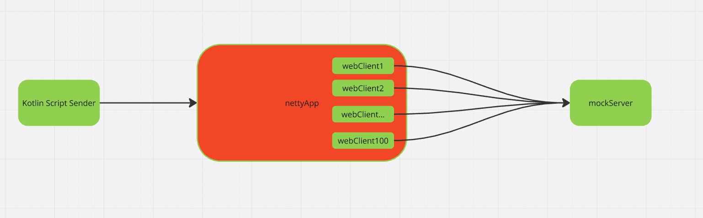
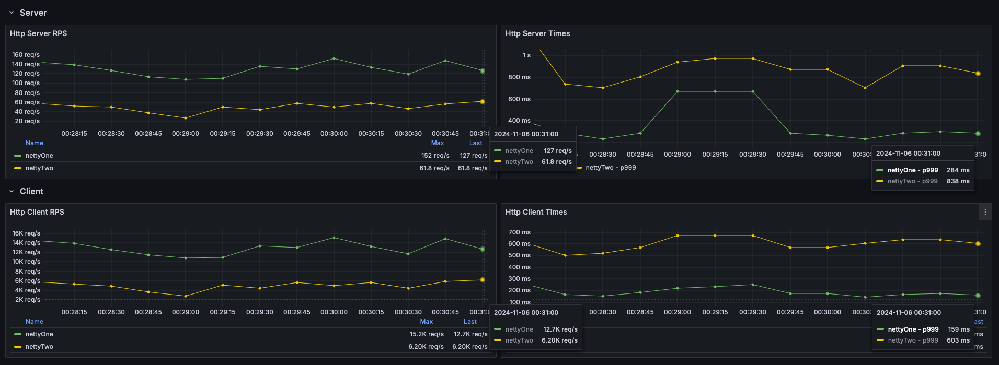

[MCVE](https://stackoverflow.com/help/minimal-reproducible-example) for https://stackoverflow.com/questions/57663290/what-is-difference-between-com-sun-xml-bind-xmldeclaration-false-and-jaxb-fra


# How To Run
1. Execute given command to start two netty apps and a mock server
```shell
./run.sh
```

2. Run kotlin scripts from IntelliJ

# Expected behaviour:
More RPS for `script1.main.kts`

# Architecture


# Grafana Screenshot
